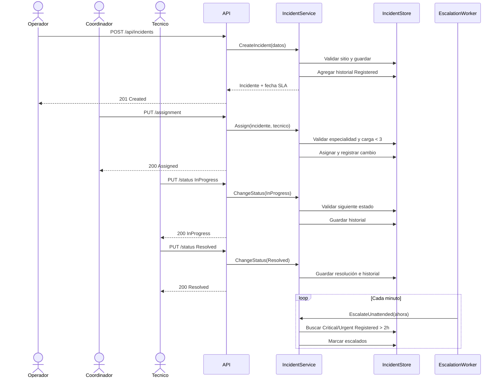

# Diagrama de secuencia

Caso principal: registro, asignación y atención de un incidente.

```mermaid
sequenceDiagram
    actor Operador
    actor Coordinador
    actor Tecnico
    participant API
    participant Servicio as IncidentService
    participant Store as IncidentStore
    participant Worker as EscalationWorker

    Operador->>API: POST /api/incidents
    API->>Servicio: CreateIncident(datos)
    Servicio->>Store: Validar sitio y guardar
    Servicio->>Store: Agregar historial Registered
    Servicio-->>API: Incidente + fecha SLA
    API-->>Operador: 201 Created

    Coordinador->>API: PUT /assignment
    API->>Servicio: Assign(incidente, tecnico)
    Servicio->>Store: Validar especialidad y carga < 3
    Servicio->>Store: Asignar y registrar cambio
    API-->>Coordinador: 200 Assigned

    Tecnico->>API: PUT /status InProgress
    API->>Servicio: ChangeStatus(InProgress)
    Servicio->>Store: Validar siguiente estado
    Servicio->>Store: Guardar historial
    API-->>Tecnico: 200 InProgress

    Tecnico->>API: PUT /status Resolved
    API->>Servicio: ChangeStatus(Resolved)
    Servicio->>Store: Guardar resolución e historial
    API-->>Tecnico: 200 Resolved

    loop Cada minuto
        Worker->>Servicio: EscalateUnattended(ahora)
        Servicio->>Store: Buscar Critical/Urgent Registered > 2h
        Servicio->>Store: Marcar escalados
    end
```
